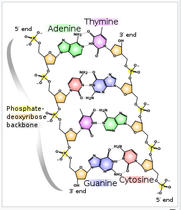
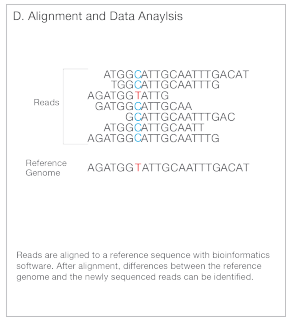

# Analyzing DNA

DNA is a molecule composed of two polynucleotide chains wrapped around each other in the shape of a double helix.

DNA is further organized into chromosomes which are packed into the nucleus of a cell.

So how do we get data from a nucleotide polymer in a chromosome, in a nucleus, in a cell? Well a common approach is to leverage something called Next Generation Sequencing. Here is how that is accomplished:

1. **Library Preparation**: DNA is fragmented, adapters are added to those fragments - creating a Sequencing library. 

2. **Cluster Amplification**: The adapters then are stuck to a flow cell, and these bound fragments are amplified to increase the signal.

3. **Sequencing**: Fluorescently labeled nucleotides are added to the flow cell and as they attach to the DNA they emit a signal which is picked up by the sequencing machine, telling it the identity and position of the base in the fragment. These fragments are then read to create reads - text files with sequence of each dna fragment.

4. **Alignment/Data Analysis**: Now that we have these reads, we can align them to a known sequence and perform analyses.

With these reads we can perform all kinds of analysis workflows. Here we explore the following:

  * [Assembly](assembly/assembly.md)
  * [Variant Calling](variantCalling/variantCalling.md)
  * [ATAC-seq](atacSeq/atacSeq.md)
  * [Methylation Analysis](methylationAnalysis/methylationAnalysis.md)
        

## References

1. [An Introduction to Next-Generation Sequencing Technology](https://www.illumina.com/content/dam/illumina-marketing/documents/products/illumina_sequencing_introduction.pdf)
_________________________________________________________________________________________________________________________________________________________________________________

Next Workshop: [Assembly](assembly/assembly.md)

[Return To The Main Page](../index.md)
