# Assembly

So say you don't have a perfectly sequenced/ well characterized genome? Well you wouldn't have anything to compare your reads to. That's ok though you can build a new genome, *de novo*. In this workshop we will be using Staphylococcus aureus bacterium whole genome data. To begin we will need to take a closer look at our read data.

## Fastq File Format

Read data is stored into files called fastq files. These files are laid out like so:

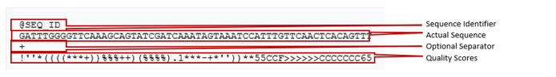

So here we can see we have a sequence identifier, the actual sequence, an optional separator and the quality scores of each base. The quality scores are encoded differently depending on the technology:

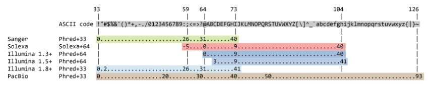

These quality scores are associated with the probability that the sequencer called the wrong base. 

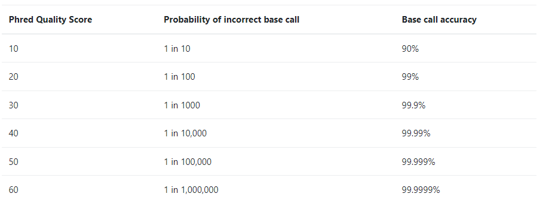

So before we go and start assembling our genome, we should confirm that our read data quality is alright.

## Quality Control

To get an idea of how well our read data quality we can use a package called FastQC. To do so we will write a bash script:

    #!/bin/bash
    
    # Download read data and run FastQC #
    
    # make a directory for raw data
    mkdir raw_data
    cd raw_data
    
    # download it
    wget https://zenodo.org/record/582600/files/mutant_R1.fastq
    wget https://zenodo.org/record/582600/files/mutant_R2.fastq
    
    # make an output directory
    cd ../
    mkdir fastqc
    
    # run fastqc
    fastqc raw_data/* -o fastqc
    
So in the script we do a little house keeping and create directories for our raw data and quality control results. We then download our read data and run FastQC. FastQC will output an html file with summary plots and flat text files with this data per fastq file. Let's examine the plots!

### Per base sequence quality

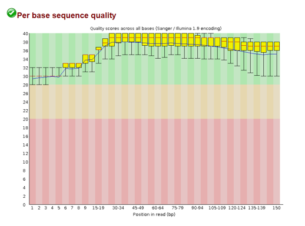

Here we see the distribution of quality scores per position in the read. The plot is separated into three regions: green, orange, red. If the scores mainly fall into the green bin, your quality scores are all good. If they dip into the orange/red, you'll want to consider removing those before going forward.
    
### Per sequence quality scores

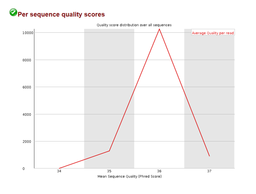

Here we can see the distribution of the average quality score per read. If we see a spike on the lower end of the quality score range, we know there are a subset of reads with very poor quality.

### Per base sequence content

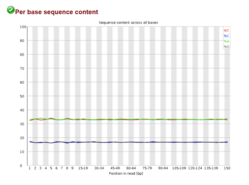

This plot shows us the percentage of A,G,C, and T at different positions in our reads. We *expect* that these levels stay consistent across the read in a random library. However, if these levels are not flat across the plot, it could indicate an overrepresented sequence in our data. 

### Per sequence GC content

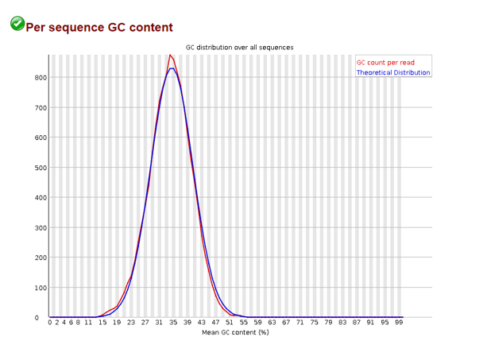

Here the average GC content per sequence is displayed and in a normal random library you would like this to approximate a bell curve. If your actual distribution is unusually shaped and doesn't match the theoretical distribution, you may have a contaminated library. 

> NOTE: contaminated doesn't necessarily mean your library wasn't prepared under clean conditions. In eukaryotic organisms, this may point to a viral infection - wherein a virus has integrated their genome to the host.

### Per base N content

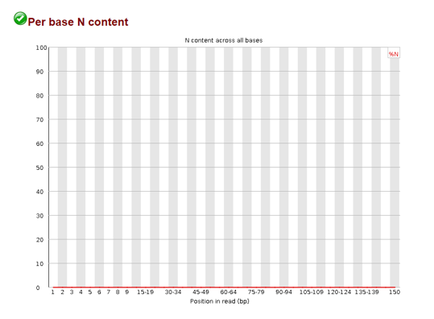

When the sequencer cannot determine a base in a sequence it will insert an "N" in the sequence. The plot above maps the N content per position in the read. It is also advised that these be removed as well when they appear in excess. 

### Sequence Length Distribution

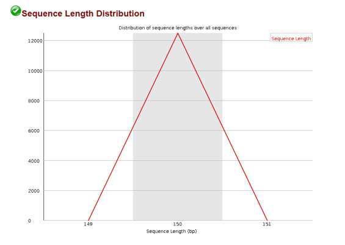

When we fragment our DNA we often times expect some uniform fragment. We can use the sequence length distribution plot to confirm most of our sequences are of that length.

### Sequence Duplication Levels

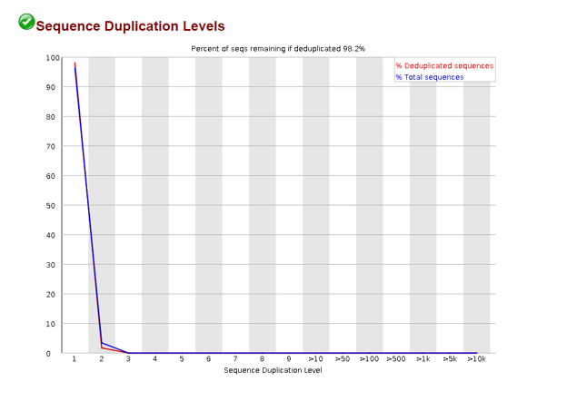

In the process of amplifying our DNA it is possible to over represent a particular sequence. We can check the sequence duplication levels plot to confirm that most of our sequences are only seen once.

### Overrepresented sequences

If this plot is populated (here it was not) it means you have a sequence that is more than 0.1% of the total number of sequences. FastQC will go through and match these to common contaminants to give you a clue as to what the contaminant might be. If FastQC cannot match the sequence, try using [BLAST](https://blast.ncbi.nlm.nih.gov/Blast.cgi?PROGRAM=blastn&BLAST_SPEC=GeoBlast&PAGE_TYPE=BlastSearch) to identify the sequence. 

> NOTE: In RNA-seq it is expected that you might have overrepresented sequences depending on how much RNA is being made. DNA is expected to stay consistent and that is why we remove these overrepresented sequences here. 


### Adapter Content

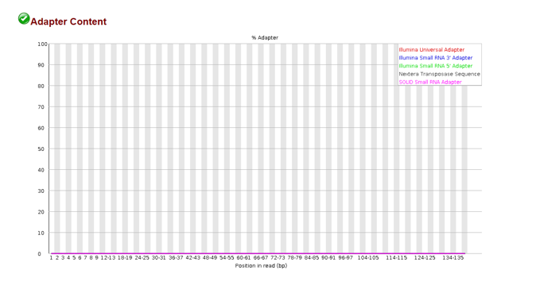
  
In the process of getting read data, we needed to add adapters to our DNA fragments so that they would stick to our flow cell. The plot above shows the adapter content at different positions in a read. If we see there are adapters present, we should remove them before going forward.

### Read Trimming

While our data looks good, given the FastQC plots above, we will be thorough and run our reads through a trimming program called TrimGalore. 

    #!/bin/bash
    
    # Trim our read data #
    
    # create a directory for our trimmed data
    mkdir trim
    
    #run trim galore at default settings
    trim_galore --paired -o trim raw_data/*

We make sure to specify here that our data is paired so that it is trimmed correctly. By default, TrimGalore will autodetect partial/full adapters and remove them. Additionally, it will remove low quality bases and per our specifcation will output the trimmed files into the trim folder. 
    

## Assemble Reads

Now that we have cleaned read data we can start to do some assembly. But what does this mean? Here is a graphic to make better sense of it:


Here we see that to construct a genome we need to take our read data and *assemble* it into contigs which serve as a scaffold for our new genome! To assemble our reads into contigs we can use a program called Velvet. Velvet assembles our reads by using a de Bruijn graph a type of graph that displays overlaps between sequences. Determining these overlaps will help determine the order in which these sequences occur in our genome. 

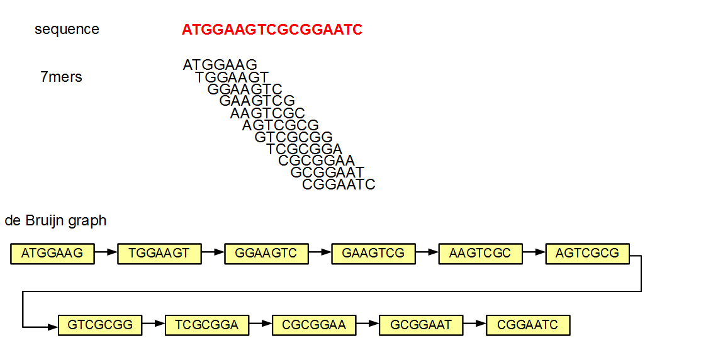

But Velvet will need us to specify how large our kmers are going to be. Smaller kmers are great for determining the best connectivity and thereby the best sequence order and larger kmers will result in better specificity since you aren't breaking it down as much. Here we will use a kmer length of 57.

    #!/bin/bash
    
    # Assemble our reads #
    
    # Break into k-mers with a length of 57
    velveth velvet_57 57 -fmtAuto -create_binary -shortPaired -separate ./trim/mutant_R1_val_1.fq ./trim/mutant_R2_val_2.fq
    
    # Assemble into a contig fasta
    velvetg velvet_57
    
Our contig file will be in the velvet_57 folder and named contigs.fa. Let's go over what the headers mean:

    >NODE_11_length_79_cov_21.594936
    TTGAACATTGGTTTTATGCAAGATCAGTAGAGATAACTGTAAAATGTTCTTAATATTGTC
    AAAATGTAATGCTTGAAAGCGCTTTTAAAAAATATTATTATATACAT
    >NODE_15_length_550_cov_29.652727
    TTTTTTATTTTGAGTGGTTTTGTCCGTTACACTAGAAAACCGAAAGACAATAAAAATTTT
    ATTCTTGCTGAGTCTGGCTTTCGGTAAGCTAGACAAAACGGACAAAATAAAAATTGGCAA
    GGGTTTAAAGGTGGAGATTTTTTGAGTGATCTTCTCAAAAAATACTACCTGTCCCTTGCT
    GATTTTTAAACGAGCACGAGAGCAAAACCCCCCTTTGCTGAGGTGGCAGAGGGCAGGTTT
    TTTTGTTTCTTTTTTCTCGTAAAAAAAAGAAAGGTCTTAAAGGTTTTATGGTTTTGGTCG
    GCACTGCCGACAGCCTCGCAGAGCACACACTTTATGAATATAAAGTATAGTGTGTTATAC
    TTTACTTGGAAGTGGTTGCCGGAAAGAGCGAAAATGCCTCACATTTGTGCCACCTAAAAA
    GGAGCGATTTACATATGAGTTATGCAGTTTGTAGAATGCAAAAAGTGAAATCAGCTGGAC
    TAAAAGGCATGCAATTTCATAATCAAAGAGAGCGAAAAAGTAGAACGAATGATGATATTG
    ACCATGAGCGAACACGTGAAAATTATGATTTGAAAAAT

So here we see each sequences is headed by a header with the node number, the sequence length, and the coverage. The node number is the node number in the de Brujin graph, the length of the sequence is a measure of how many kmers overlapped by at least one base pair and the coverage is a measure of how many kmers overlap at each position. So for the first header ```NODE_11_length_79_cov_21.594936```:

* The sequence is for node 11 in the graph
* The length of the sequence is 79 base pairs 
* The kmer coverage is ~21.59
    

## Assembly Statistics

In the velvet_57 folder you will find a log folder with information on the total number of nodes, N50 value, the max contig length, and the total length of the assembly.

## References

1. [An Introduction to Genome Assembly](https://training.galaxyproject.org/training-material/topics/assembly/tutorials/general-introduction/tutorial.html)
2. [Quality Control](https://training.galaxyproject.org/training-material/topics/sequence-analysis/tutorials/quality-control/tutorial.html)
_________________________________________________________________________________________________________________________________________________________________________________

Next Workshop: [Variant Calling](../variantCalling/variantCalling.md)

[Back To DNA Workshops](../DNA.md)

[Back To The Main Page](../../index.md)
