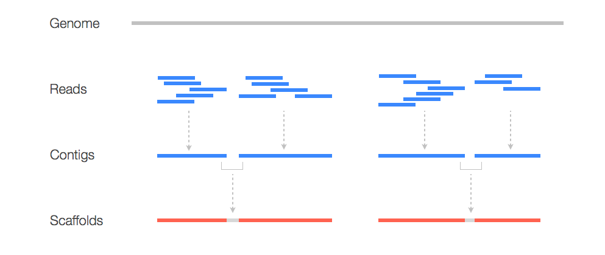
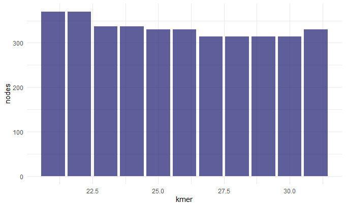
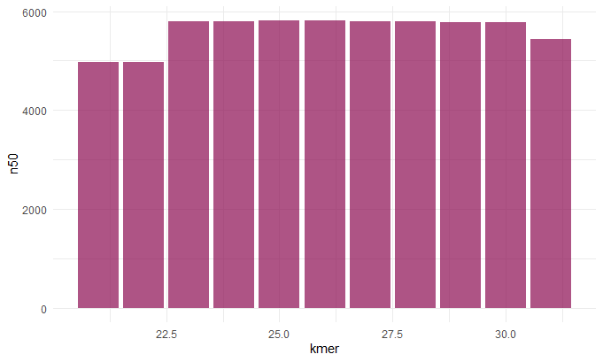
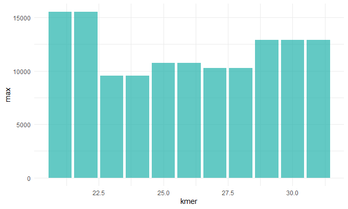
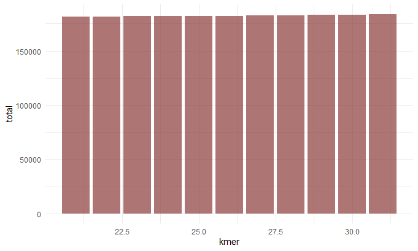

# Assembly

So say you don't have a perfectly sequenced/ well characterized genome? Well you wouldn't have anything to compare your reads to. That's ok though you can build a new genome, *de novo*. In this workshop we will be using Staphylococcus aureus bacterium whole genome data. To begin we will need to take a closer look at our read data.

## Quality Control

To get an idea of how well our read data quality we can use a package called FastQC. To do so we will write a bash script:

    #!/bin/bash
    
    # Download read data and run FastQC #
    
    # make a directory for raw data
    mkdir raw_data
    cd raw_data
    
    # download it
    wget https://zenodo.org/record/582600/files/mutant_R1.fastq
    wget https://zenodo.org/record/582600/files/mutant_R2.fastq
    
    # make an output directory
    cd ../
    mkdir fastqc
    
    # run fastqc
    fastqc raw_data/* -o fastqc
    
So in the script we do a little house keeping and create directories for our raw data and quality control results. We then download our read data and run FastQC. FastQC will output an html file with summary plots and flat text files with this data per fastq file. To better understand what these plots mean please check out the workshop on [Quality Control](../qualityControl/qualityControl.md).

### Read Trimming

While our data looks good, given the FastQC plots generated above, we will be thorough and run our reads through a trimming program called TrimGalore. 

    #!/bin/bash
    
    # Trim our read data #
    
    # create a directory for our trimmed data
    mkdir trim
    
    #run trim galore at default settings
    trim_galore --paired -o trim raw_data/*

We make sure to specify here that our data is paired so that it is trimmed correctly. By default, TrimGalore will autodetect partial/full adapters and remove them. Additionally, it will remove low quality bases and per our specifcation will output the trimmed files into the trim folder. 
    

## Assemble Reads

Now that we have cleaned read data we can start to do some assembly. But what does this mean? Here is a graphic to make better sense of it:



Here we see that to construct a genome we need to take our read data and *assemble* it into contigs which serve as a scaffold for our new genome! To assemble our reads into contigs we can use a program called Velvet. Velvet assembles our reads by using a de Bruijn graph a type of graph that displays overlaps between sequences. Determining these overlaps will help determine the order in which these sequences occur in our genome. 


But Velvet will need us to specify how large our kmers are going to be. Smaller kmers are great for determining the best connectivity and thereby the best sequence order and larger kmers will result in better specificity since you aren't breaking it down as much. Here we will try different kmer lengths ranging from 21 to 31.

    #!/bin/bash

    # Run velvet for different kmer lengths #
    
    #make a directory to house all the velvet output
    mkdir velvet

    #loop through different kmer lengths
    for i in 21 22 23 24 25 26 27 28 29 30 31
    do
            #run velvet at different kmer lengths
            velveth ./velvet/velvet_$i $i -fmtAuto -create_binary -shortPaired -separate ./trim/mutant_R1_val_1.fq ./trim/mutant_R2_val_2.fq
            #assemble into contigs
            velvetg ./velvet/velvet_$i
    done
    
Here we create an output folder called velvet and loop through different kmer lengths and run velvet using those different lengths. For each length, velvet will output an output folder with our contig files, a log, a stats file and other files we won't discuss here. For more information please see the [velvet documentation](https://www.ebi.ac.uk/~zerbino/velvet/Manual.pdf). Let's check out one of the contig files to understand it's structure (note in each output folder the contig file will be called "contig.fa"):

    >NODE_11_length_79_cov_21.594936
    TTGAACATTGGTTTTATGCAAGATCAGTAGAGATAACTGTAAAATGTTCTTAATATTGTC
    AAAATGTAATGCTTGAAAGCGCTTTTAAAAAATATTATTATATACAT
    >NODE_15_length_550_cov_29.652727
    TTTTTTATTTTGAGTGGTTTTGTCCGTTACACTAGAAAACCGAAAGACAATAAAAATTTT
    ATTCTTGCTGAGTCTGGCTTTCGGTAAGCTAGACAAAACGGACAAAATAAAAATTGGCAA
    GGGTTTAAAGGTGGAGATTTTTTGAGTGATCTTCTCAAAAAATACTACCTGTCCCTTGCT
    GATTTTTAAACGAGCACGAGAGCAAAACCCCCCTTTGCTGAGGTGGCAGAGGGCAGGTTT
    TTTTGTTTCTTTTTTCTCGTAAAAAAAAGAAAGGTCTTAAAGGTTTTATGGTTTTGGTCG
    GCACTGCCGACAGCCTCGCAGAGCACACACTTTATGAATATAAAGTATAGTGTGTTATAC
    TTTACTTGGAAGTGGTTGCCGGAAAGAGCGAAAATGCCTCACATTTGTGCCACCTAAAAA
    GGAGCGATTTACATATGAGTTATGCAGTTTGTAGAATGCAAAAAGTGAAATCAGCTGGAC
    TAAAAGGCATGCAATTTCATAATCAAAGAGAGCGAAAAAGTAGAACGAATGATGATATTG
    ACCATGAGCGAACACGTGAAAATTATGATTTGAAAAAT

So here we see each sequences is headed by a header with the node number, the sequence length, and the coverage. The node number is the node number in the de Brujin graph, the length of the sequence is a measure of how many kmers overlapped by at least one base pair and the coverage is a measure of how many kmers overlap at each position. So for the first header ```NODE_11_length_79_cov_21.594936```:

* The sequence is for node 11 in the graph
* The length of the sequence is 79 base pairs 
* The kmer coverage is ~21.59
    

## Assembly Statistics

So we generated 10 different contig files using different kmer lengths. How do we know which contig file is the superior assembly? Well to do so let's make use the following R script:

    # Assess contig files based on N50, max contig length, and total contig length #
    library(ggplot2)

    #set empty vectors
    kmer <- numeric()
    nodes <- numeric()
    n50 <- numeric()
    max <- numeric()
    total <- numeric()

    #loop through our different contig lengths 
    for(i in 21:31){
      log=read.delim(paste("./velvet/velvet_",as.character(i),"/Log",sep = ""))
      nodes.i <- as.numeric(strsplit(strsplit(log[18,],"graph has ")[[1]][2]," ")[[1]][1])
      n50.i <- as.numeric(strsplit(strsplit(log[18,],"n50 of ")[[1]][2],",")[[1]][1])
      max.i <- as.numeric(strsplit(strsplit(log[18,],"max ")[[1]][2],",")[[1]][1])
      total.i <- as.numeric(strsplit(strsplit(log[18,],"total ")[[1]][2],",")[[1]][1])
      kmer <- c(kmer,i)
      nodes <- c(nodes,nodes.i)
      n50 <- c(n50,n50.i)
      max <- c(max,max.i)
      total <- c(total,total.i)
    }

    #let's create some plots to help us make sense of our contigs
    df <- data.frame(kmer,
                     nodes,
                     n50,
                     max,
                     total)

    ggplot(data=df, aes(x=kmer, y=nodes)) +
      geom_bar(stat="identity",fill="midnightblue",alpha=.7)+
      theme_minimal()

    ggplot(data=df, aes(x=kmer, y=n50)) +
      geom_bar(stat="identity",fill="deeppink4",alpha=.7)+
      theme_minimal()

    ggplot(data=df, aes(x=kmer, y=max)) +
      geom_bar(stat="identity",fill="lightseagreen",alpha=.7)+
      theme_minimal()

    ggplot(data=df, aes(x=kmer, y=total)) +
      geom_bar(stat="identity",fill="indianred4",alpha=.7)+
      theme_minimal()

In this script we loop through our different folders and pick out the Log file with information on the total number of contigs, kmer length, N50 value, max contig length and total contig length. We then get the following plots:

Kmer v. Nodes/Number of Contigs



Kmer v. N50



Kmer v. Max Contig Length



Kmer v. Total Contig Length



Before we continue we should talk about the N50 value. To get this value you line up the contigs smallest to largest, and pick the contig length where half of the contigs would be that size or larger. This is sort of a measure of how complete your assembly is. So now that we understand this term we can make sense of these graphs. When chosing our best assembly we chose the kmer length that best balances all these metrics. We see that close to 30: the number of contigs decreases (indicating they a more contiguous sequence), the N50 value inceases(indicating a more complete assembly), the max contig length increases (indicating larger contigs and hence a more contiguous sequence). 

## References

1. [An Introduction to Genome Assembly](https://training.galaxyproject.org/training-material/topics/assembly/tutorials/general-introduction/tutorial.html)
2. [Quality Control](https://training.galaxyproject.org/training-material/topics/sequence-analysis/tutorials/quality-control/tutorial.html)

_________________________________________________________________________________________________________________________________________________________________________________

Next Workshop: [Variant Calling](../variantCalling/variantCalling.md)

[Back To DNA Workshops](../DNA.md)

[Back To The Main Page](../../index.md)
