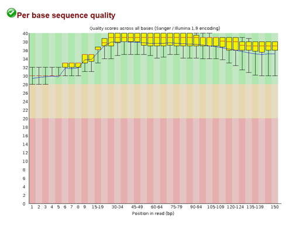
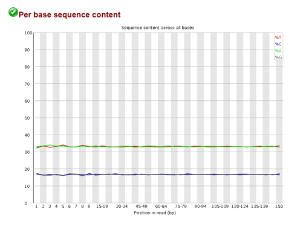
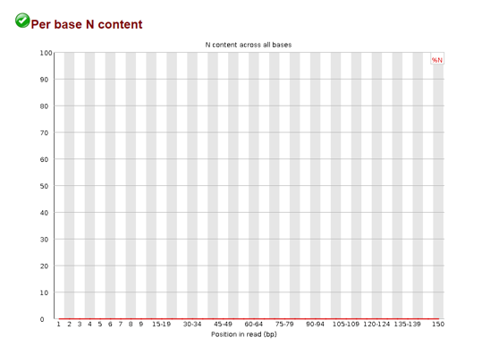
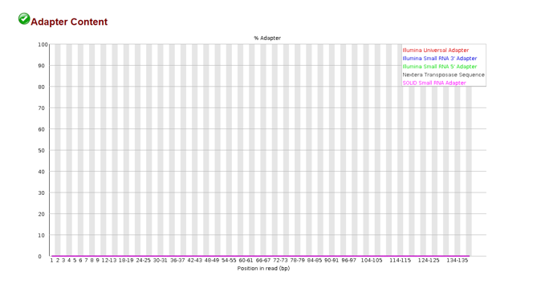

## Fastq File Format

Read data is stored into files called fastq files. These files are laid out like so:

So here we can see we have a sequence identifier, the actual sequence, an optional separator and the quality scores of each base. The quality scores are encoded differently depending on the technology:

These quality scores are associated with the probability that the sequencer called the wrong base. 

So before we go and start assembling our genome, we should confirm that our read data quality is alright.

## Quality Control

To get an idea of how well our read data quality we can use a package called FastQC. To do so we will write a bash script:

    #!/bin/bash
    
    # Download read data and run FastQC #
    
    # make a directory for raw data
    mkdir raw_data
    cd raw_data
    
    # download it
    wget https://zenodo.org/record/582600/files/mutant_R1.fastq
    wget https://zenodo.org/record/582600/files/mutant_R2.fastq
    
    # make an output directory
    cd ../
    mkdir fastqc
    
    # run fastqc
    fastqc raw_data/* -o fastqc
    
So in the script we do a little house keeping and create directories for our raw data and quality control results. We then download our read data and run FastQC. FastQC will output an html file with summary plots and flat text files with this data per fastq file. Let's examine the plots!

### Per base sequence quality

Here we see the distribution of quality scores per position in the read. The plot is separated into three regions: green, orange, red. If the scores mainly fall into the green bin, your quality scores are all good. If they dip into the orange/red, you'll want to consider removing those before going forward.
    
### Per sequence quality scores

Here we can see the distribution of the average quality score per read. If we see a spike on the lower end of the quality score range, we know there are a subset of reads with very poor quality.

### Per base sequence content

This plot shows us the percentage of A,G,C, and T at different positions in our reads. We *expect* that these levels stay consistent across the read in a random library. However, if these levels are not flat across the plot, it could indicate an overrepresented sequence in our data. 

### Per sequence GC content

Here the average GC content per sequence is displayed and in a normal random library you would like this to approximate a bell curve. If your actual distribution is unusually shaped and doesn't match the theoretical distribution, you may have a contaminated library. 

> NOTE: contaminated doesn't necessarily mean your library wasn't prepared under clean conditions. In eukaryotic organisms, this may point to a viral infection - wherein a virus has integrated their genome to the host.

### Per base N content

When the sequencer cannot determine a base in a sequence it will insert an "N" in the sequence. The plot above maps the N content per position in the read. It is also advised that these be removed as well when they appear in excess. 

### Sequence Length Distribution

When we fragment our DNA we often times expect some uniform fragment. We can use the sequence length distribution plot to confirm most of our sequences are of that length.

### Sequence Duplication Levels

In the process of amplifying our DNA it is possible to over represent a particular sequence. We can check the sequence duplication levels plot to confirm that most of our sequences are only seen once.

### Overrepresented sequences

If this plot is populated (here it was not) it means you have a sequence that is more than 0.1% of the total number of sequences. FastQC will go through and match these to common contaminants to give you a clue as to what the contaminant might be. If FastQC cannot match the sequence, try using [BLAST](https://blast.ncbi.nlm.nih.gov/Blast.cgi?PROGRAM=blastn&BLAST_SPEC=GeoBlast&PAGE_TYPE=BlastSearch) to identify the sequence. 

> NOTE: In RNA-seq it is expected that you might have overrepresented sequences depending on how much RNA is being made. DNA is expected to stay consistent and that is why we remove these overrepresented sequences here. 

### Adapter Content

  
In the process of getting read data, we needed to add adapters to our DNA fragments so that they would stick to our flow cell. The plot above shows the adapter content at different positions in a read. If we see there are adapters present, we should remove them before going forward.
