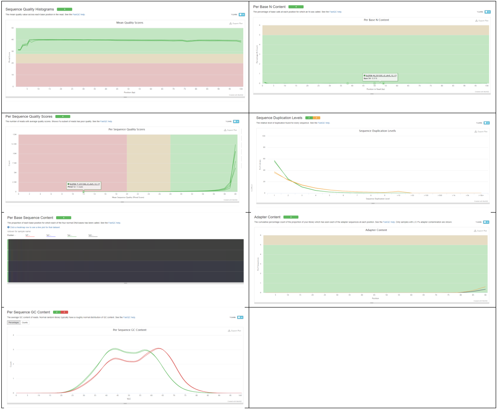

# Variant Calling

Compiling a reference sequence does not mean that sequence is the same across all orgainisms in that species. In fact the genome can vary significantly depending on your race, age and general environment. So when calling a DNA variant it is important to keep that in mind. Often times in diseases, like cancer which we will be talking about today, mutations are picked up just through living and not by some inheritance mechanism. These "picked up" mutations are called **somatic mutations** and the ones you inherit and can pass on are called **germline mutations**. 

The genomic landscape in tumor is complicated and in addition to variants being acquired, tumors can gain or lose copies of a variant that would otherwise be heterozygous in a normal individual. This is called **loss of heterozygosity** and it is pretty common in tumor suppressor genes - wherein a loss here would leave it susceptible to mutation and hence inactivation. The identification of what is a heterozyguos loss and what is germline/somatic relies on a match between samples. So for one patient you need their tumor and a normal tissue sample. This is called a matched normal. Let's get to it then!

## Quality Control

Let's start by writing a bash script to download sequencing data from a individual. We will be downloading paired tumor data and paired matched normal data. 

    #!/bin/bash
    
    # Download data and perform FastQC #
    
    #make directory for raw data
    mkdir raw_data
    cd raw_data

    wget https://zenodo.org/record/2582555/files/SLGFSK-N_231335_r1_chr5_12_17.fastq.gz
    wget https://zenodo.org/record/2582555/files/SLGFSK-N_231335_r2_chr5_12_17.fastq.gz
    wget https://zenodo.org/record/2582555/files/SLGFSK-T_231336_r1_chr5_12_17.fastq.gz
    wget https://zenodo.org/record/2582555/files/SLGFSK-T_231336_r2_chr5_12_17.fastq.gz
    cd ../
    
    #make a directory for fastqc results
    mkdir fastqc
    
    #run FastQC on normal and tumor data
    fastqc raw_data/* -o fastqc
    
    #run multiqc on our data
    source activate multiqc_1.11
    cd fastqc
    multiqc .

In the preceding script we make a directory for our data, download it, run FastQC on it, and then run MultiQC on the FastQC results. For help interpreting FastQC plot see our workshop on [Quality Control](../qualityControl/qualityControl.md). MultiQC is a tool that can combine FastQC reports into one document for ease of viewing. MultiQC is available through conda and we access it via a virtual environment. To learn how to create your own virtual environment with custom packages installed visit [Conda Documentation](https://docs.conda.io/projects/conda/en/latest/user-guide/tasks/manage-environments.html). Here are the resulting plots:

Here we note that the quality scores look good and the ratio of base pairs is good. However, we can see that there are duplicated sequences, adapters present and the shape of the GC content distribution is off for the tumor samples. Let's go about fixing what we can with a trimming tool.

## Trimming and Filtering

To trim we will be using a tool called Trimmomatic. Trimmomatic will ask that you specify the adapter for it. Let's write a bash script to go through and trim our read data.

    #!/bin/bash
    
    # Trim our read data #
    
    # Make a directory for our trimmed read data and adapters
    mkdir trim
    mkdir adapter
    
    # Grab our adapters
    wget https://github.com/timflutre/trimmomatic/blob/master/adapters/TruSeq3-PE-2.fa -P adapter/
    
    # Activate our trimmomatic environment
    source activate trimmomatic_0.39
    adapterfile=adapter/TruSeq3-PE-2.fa
  
    # Trim normal tissue
    trimmomatic PE raw_data/SLGFSK-N_231335_r1_chr5_12_17.fastq.gz raw_data/SLGFSK-N_231335_r2_chr5_12_17.fastq.gz \
                trim/SLGFSK-N_231335_r1.trim.fastq.gz trim/SLGFSK-N_231335_r1.un.trim.fastq.gz \
                trim/SLGFSK-N_231335_r2.trim.fastq.gz trim/SLGFSK-N_231335_r2.un.trim.fastq.gz \
                SLIDINGWINDOW:4:20 MINLEN:25 ILLUMINACLIP:$adapterfile:2:30:10:8
    
    # Trim tumor tissue
    trimmomatic PE raw_data/SLGFSK-T_231336_r1_chr5_12_17.fastq.gz raw_data/SLGFSK-T_231336_r2_chr5_12_17.fastq.gz \
                trim/SLGFSK-T_231336_r1.trim.fastq.gz trim/SLGFSK-T_231336_r1.un.trim.fastq.gz \
                trim/SLGFSK-T_231336_r2.trim.fastq.gz trim/SLGFSK-T_231336_r2.un.trim.fastq.gz \
                SLIDINGWINDOW:4:20 MINLEN:25 ILLUMINACLIP:$adapterfile:2:30:10:8
                
                
   
   
## Mapping Reads

## References

1. [Loss of Heterozygosity](https://en.wikipedia.org/wiki/Loss_of_heterozygosity)
2. [Identification of somatic and germline variants from tumor and normal sample pairs](https://training.galaxyproject.org/training-material/topics/variant-analysis/tutorials/somatic-variants/tutorial.html)
___________________________________________________________________________________________________________________________________________________________________________________

Next Workshop: [ATAC-seq](atacSeq/atacSeq.md)

[Back To DNA Workshops](../DNA.md)

[Back To The Main Page](../../index.md)
