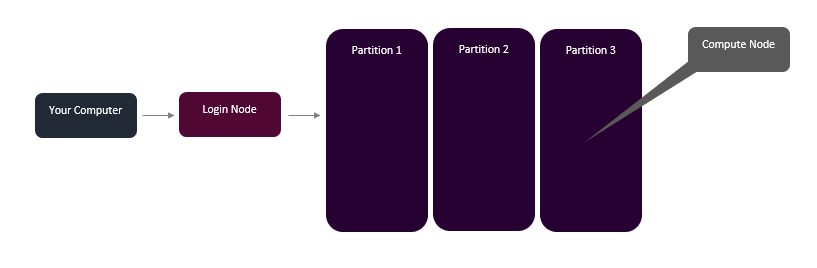
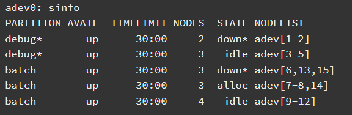
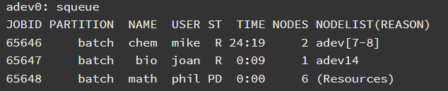

# HPC

## Introduction to Workload Management
Now that we have covered Linux commands and how to put them in a script we can talk about how to manage running scripts. Some jobs could take a few minutes and some could take a few days depending on resources. It is at this point that we usually leverage High Performance Computing (HPC) clusters. Typically, you'll get to a cluster either through the HPC website, where they will have a way for you to open a linux environment online or through an ssh command that looks like this:

```ssh yourHpcCluster```

## Login Node

Now that you have made it to the HPC cluster, you will be at a login node. And you can think of a login node like a waiting room. **DO NOT** run any scripts here. For that you will need to leave the login node and get to a compute node. You can either get an interactive session on a compute node or run a batch script from the login node to run scripts. Let's look at a common structure for HPC clusters:



## Interactive Session

Now there are a few workload managers out there, in this tutorial we will demonstrate Slurm - a popular choice for HPC users. Slurm comes with commands we can use to manage our workload. The Slurm command to get to an interactive session is ```srun```, here is an example:

```srun -p batch -t 1-2:30:00 -n 1 --mem=2Gb --pty bash```

Let's break it down:

```srun``` our command to start an interactive session

```-p batch``` is telling us to use a compute node in the batch partition

```-t 1-2:30:00``` is the time we will use that node so here we are using it for 1 day, 2 hours, 30 minutes and 0 seconds

```-n 1``` is saying we will only need 1 compute node

```--mem=2Gb``` is saying we will only need 2GB of memory

```--pty bash``` is saying we would like a bash environment

To go back to the login node, just use ```exit```

## Checking Avaialble Nodes

We just demonstrated how to get to an interactive session on a compute node in the batch partition. But what if the batch partition is being used for other jobs? You can use ```sinfo``` to identify partitions, their availability, time limit for which they can be used, how many nodes are available, their state, and the list of available nodes:



## Using a Module

Now what if you want to use some package, like BLAST, SRA Toolkit, etc.? You'll need the following commands to investigate/load your modules:

Checking available modules: ```module avail```

Checking if a particular software is installed: ```module avail softwarename```  

Load software: ```module load softwarename``` 

Unload software: ```module unload softwarename``` 

Purge all software: ```modlue purge softwarename```

Check what is installed: ```module list``` 

## Writing a Batch Script

Interactive sessions are great for quick jobs, but say you want to run a job that can't be finished in an hour or two. For that we need a batch script! Let's see an example of one:

``` 
#!/bin/bash

#SBATCH --job-name=jobID

#SBATCH --time=03-00:00:00

#SBATCH --partition=batch

#SBATCH --nodes=1

#SBATCH --mem=64Gb

#SBATCH --output=%j.out

#SBATCH --error=%j.err

#SBATCH --mail-type=ALL

#SBATCH --mail-user=YourEmailAddress

module load sra/2.10.8

#dir will be the directory to store our fastq files​

dir='fastq_storage'

#make our directory and change into it

mkdir -p $dir

cd $dir

#change the path to the sra accession list based on where you put it

fastq-dump --outdir fastq --gzip --skip-technical --readids --read-filter pass --dumpbase --split-3 --clip $(</path_to_accession_list/SraAccList.txt)
```

Let's unpack this. The ```#SBATCH``` headers specify your Slurm information, so your: jobID, time it will take, the partition to use, the number of nodes to use, the memory to use, the output file, the error file, and the email address to notify. Then we can go about writing our script! Say we save this script as ```sraPull.sh```. we can then submit this script using:

```sbatch sraPull.sh```

## Checking on Your Job

Congrats you have submitted a batch script! To check on how it's doing we can use ```squeue```:



We can also check per user with ```squeue -u your-username``` or per partition with ```squeue -p partitionOfInterest```.

## Cancel Your Job

If for some reason you would like to cancel your job, you can do that with the following command:

```scancel jobIDYouWantToCancel```

## Learning More

If you are interested in learning more there are a lot of great tutorials out there:

[SchedMD](https://slurm.schedmd.com/quickstart.html)

## References 

1.[SchedMD](https://slurm.schedmd.com/quickstart.html)

[Back To Introduction to Linux](../IntroToLinux.md)

[Back To The Main Page](../../index.md)
