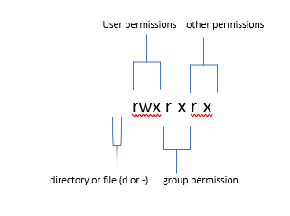
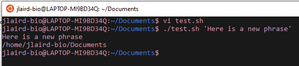

# Bash Scripting

## Creating a Base Script

So now that we know the basics of command line we can perform powerful operations with a script. To get started let's create a simple script to tell us where we are. First you'll create a file, say ```test.sh```.

 > NOTE: Bash scripts will end in ```.sh```
 
 

Here we see the first line is ```#!/bin/bash``` and this is essentially telling our computer this is a script to run and not some text file. Then we write the commands our script will perform. We also note that there is a sentence starting with ```#```. This is called a comment and it won't be read by your computer as a command. These are just used to make our code clearer.

## Permission to Run the Script

Now we cannot run the script outright. That is because Linux automatically restricts permissions of new scripts. To get permission we us a command called ```chmod```. We can run ```chmod 775 test.sh``` to make this script available to everyone to read, write, and execute - Or we can use ```chmod 700 test.sh``` so that only you can read, write, and execute. Here we will let everyone modify/run it:

 
 
## Permissions For You/Group/Others

We can also specify permissions for you, the group and others. But first let's go into what is what:



If you'll remember you can see permissions with ```ls -l```. ```r``` is read access, ```w``` is write access, and ```x``` is execute access. If you see a dash, that means the permission is not there. To change them you can specify user, group or other with ```u```, ```g```, and ```o```, respectively. You can add a permission with ```+``` and remove them with ```-```. So as an example to add read access to the group you can use ```chmod g+r file1```

## Using Variables

So we have a script! Let's make it more complicated with variables. Variables allow us to avoid repetition and can be easily switched out when needed.


Here we define a variable ```sayinghi``` and use it before ```pwd``` so that when we run the script:


Cool right? The only thing to note is you CANNOT use spaces and you reference that variable with a ```$```.

## Specify Variables Outside of the Script

Now what if you wanted to specify the variable out of the script? You can use a place holder like so:




So instead of specifying our phrase in the script we used ```$1``` as a placeholder, then specified it when we went to go run our script. ```$1``` stands for the first argument, and this would work for as many variables as you want!

> NOTE: Command line arguments are numbered ```$1, $2, $3, etc.```

## Using Loops

What if you wanted to iterate through something so you wouldn't have to write the command over and over again? You can do that using loops!


Here we loop through a list and print each item individually with the header ```This is the Letter```.

## Special Characters

Unix also has special characters for us to use:

```|``` allows you to combine commands, like only printing the first three lines from the output of ```cat```:


```>``` allows you to overwrite the contents of a file, so here we can add the contents of ```file2``` to ```file3```:


```>>``` allows you to append the contents of a file, so let's add the last 3 lines of ```file2``` to ```file3```:


## Using a While Loop

Let's talk about another useful special character - ```<```. This allows you to move some argument back into a command. Take for intance this while loop:


So here we read a file and echo each line. However, how do we know which file we are reading? We do that with ```<``` and specify that we are reading whatever file we put as the first agrument

## Finding Patterns

Now what if you want to find patterns? The ```grep``` command can do that! 


So let's run through these:

```grep 'a' file3``` will find the line with the pattern
```grep -o 'a' file3``` will just find the pattern and not the whole line
```grep -c 'a' file3``` will count how many times the pattern is found

## Regular Expressions

When finding patterns you can specify more complex patterns with regular expressions:

```.``` (dot) - a single character.

```?``` - the preceding character matches 0 or 1 times only.

```*``` - the preceding character matches 0 or more times.

```+``` - the preceding character matches 1 or more times.

```{n}``` - the preceding character matches exactly n times.

```{n,m}``` - the preceding character matches at least n times and not more than m times.

```[agd]``` - the character is one of those included within the square brackets.

```[^agd]``` - the character is not one of those included within the square brackets.

```[c-f]``` - the dash within the square brackets operates as a range. In this case it means either the letters c, d, e or f.

```()``` - allows us to group several characters to behave as one.

```|``` (pipe symbol) - the logical OR operation.

```^``` - matches the beginning of the line.

```$``` - matches the end of the line.

We won't go through every test case, but for a thorough review take a look at [Ryan's Tutorials](https://ryanstutorials.net/linuxtutorial/grep.php)

## References

1. [Shebang (Unix)](https://en.wikipedia.org/wiki/Shebang_(Unix))
2. [Intro To Basic Linux](https://tufts.app.box.com/s/x9aflewr2qw59pcbgcghbo9muykbi4ju)
3. [Ryan's Tutorials](https://ryanstutorials.net/linuxtutorial/grep.php)

_________________________________________________________________________________________________________________________________________________________________________________

Next Workshop: [HPC](../HPC/HPC.md)

[Back To Introduction to Linux](../IntroToLinux.md)

[Back To The Main Page](../../index.md)
