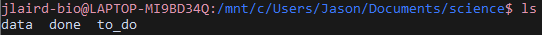
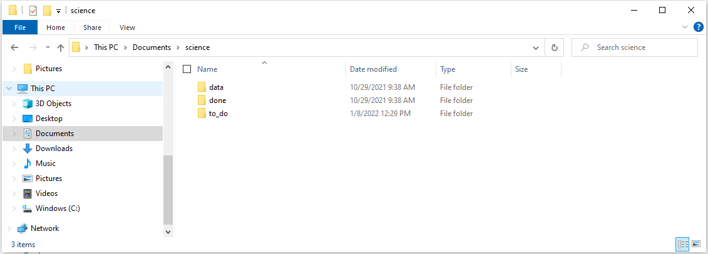

# Command Line Basics

## So what is Linux?

Linux is an operating system like Windows or Macs. In bioinformatics we use it because: 

* Most bioinformatics tools are available through Linux
* Linux is good at handling large data
* Other programming languages are available through Linux (python,R,etc.)
* It's free

## What is Command Line?

Command line the non-graphical analog to your computer:

And like the graphical interface you can modify files, execute programs and more. 

## Getting to Command Line

If you are not using accessing a cluster, 

# References
1. [towards data science](https://towardsdatascience.com/why-do-bioinformaticians-avoid-using-windows-c5acb034f63c)

[Back To Introduction to Linux](../IntroToLinux.md)

[Back To The Main Page](../../index.md)
