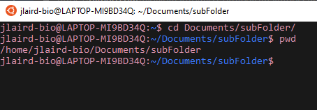
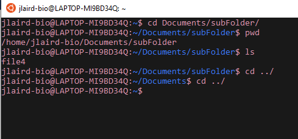
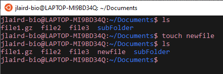
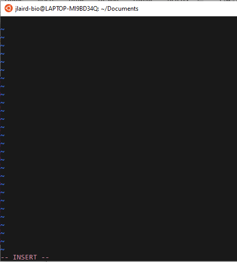

# Command Line Basics

## So what is Linux?

Linux is an operating system like Windows or Macs. In bioinformatics we use it because: 

* Most bioinformatics tools are available through Linux
* Linux is good at handling large data
* Other programming languages are available through Linux (python,R,etc.)
* It's free

## What is Command Line?

Command line the non-graphical analog to your computer

Graghical User Interface (What most people are used to):


Command Line Interface:


And like the graphical interface you can modify files, execute programs and more. 

## Getting to Command Line

Chances are you are either working on a Mac or a Windows Machine. In Mac you can get to a Linux Terminal by going to Finder and searching Terminal. Windows users aren't so lucky. If you are on a Windows Machine you'll need to download Linux terminal environmet. A favorite among bionformaticians is Ubuntu and can be downloaded [here](https://ubuntu.com/download/desktop). 

## Getting the Lay of the Land

So you've opened up a Linux terminal - Now what? Let's take a look around.

### Checking Where You Are

You can check where you are with the command ```pwd``` :


This command will **p**rint your **w**orking **d**irectory. So we see that we are in the ```jlaird-bio``` folder in the ```home``` folder.

### What is in a Folder?

To check the contents of a folder type out ```ls``` :


Here we can see that in the ```jlaird-bio``` folder we have a folder called ```Documents```. Unfortunatley, we cannot see background files, or those starting with a ".". To see them we use ```ls -a```:


Now if we want to see information about these files we can use ```ls -al```:


Here we see information on permissions, the number of links, owner name, owner group, file size, time of last modification, and the file/directory name.

## Go into a Different Folder

To go into a different folder (or **c**hange **d**irectories), like that ```Documents``` folder, we use ```cd Documents```:


To go up one folder you can use ```cd ../```

To go back to your home folder you can use either ```cd ~``` or ```cd $HOME```

But what if you wanted to go into a folder that was more that a folder away? Well we can use a path to determine where we want to go. The path is just that output from ```pwd``` that tells you the folders you are in. So from our home folder - if we wanted to go into the ```subFolder``` inside the ```Documents``` folder we use ```cd /Documents/subFolder/```:



## Cleaning Up Terminal Screen

You've been typing commands and your screen is looking a little messy:



To clear this screen you can use ```clear```:


## How To Print To The Terminal

Want to print something to the terminal? To print "Hello World" use: ```echo Hello World```:


## How to Copy a File

To copy a file to another location, like moving ```file1``` to ```/home/jlaird-bio/Documents/subFolder/```, use ```cp file1 /home/jlaird-bio/Documents/subFolder/```:


## Check What is in a File

To see what is in a file, for example ```file1```, you can use ```cat file1```:


Now what if your file is compressed? You can tell if your file is compressed if it ends in either ```.zip``` or ```.gz```. To view a compressed file, like ```file1.gz``` you can use ```zcat file1.gz```:


Now what if your file is massive and you don't want all this printed to the screen? You can use the following to get the first ten lines ```head file2```:


If you want to specify the number of lines use ```head -3 file2```:


Now If you wanted to see the last three lines use ```tail -3 file2```:


## Make a File/Directory

To make a file, say a file called ```newfile```, all you need to do is use ```touch newfile```:



To **m**a**k**e a new **dir**ectory, say a new directory called ```newdir```, use ```mkdir newdir```:


## How to Add to a File

To add to a file you'll need to use a text editor like ```vi``` or ```nano```. We will demonstrate how to use ```vi```. To open a file, like ```file3```, use ```vi file3```:


To start writing hit ```i``` then ```Enter```:



After you are done writing, you can save your work by typing ```Esc``` then ```:wq``` and hitting ```Enter```


# References
1. [towards data science](https://towardsdatascience.com/why-do-bioinformaticians-avoid-using-windows-c5acb034f63c)

[Back To Introduction to Linux](../IntroToLinux.md)

[Back To The Main Page](../../index.md)
