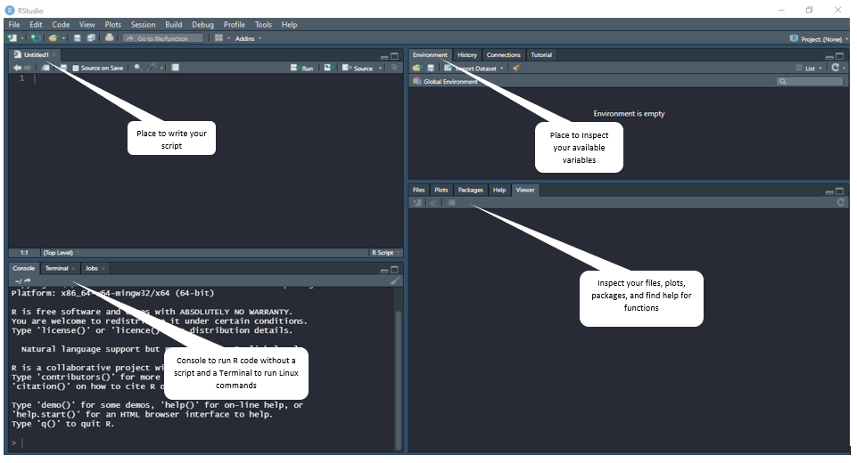

# R and RStudio

If you don't already have R installed on your computer you can install it at [The R Project for Statistical Computing](https://www.r-project.org/). Now once you have R installed on your machine you'll need a way to create code with it. While you can do so from command line, most people prefer to use RStudio to do so. RStudio is a type of IDE, or integrated development environment. It provides a number of tools that make coding much easier and can be downloaded at [Download the RStudio IDE](https://www.rstudio.com/products/rstudio/download/).

# Taking a Look Around

When you open up RStudio it will look something like this:

___________________________________________________________________________________________________________________________________________________________________________________

[Next Workshop](../Snytax_DataStructures/Snytax_DataStructures.md)

[Back To Introduction to R](../IntroToR.md)

[Back To The Main Page](../../index.md)
